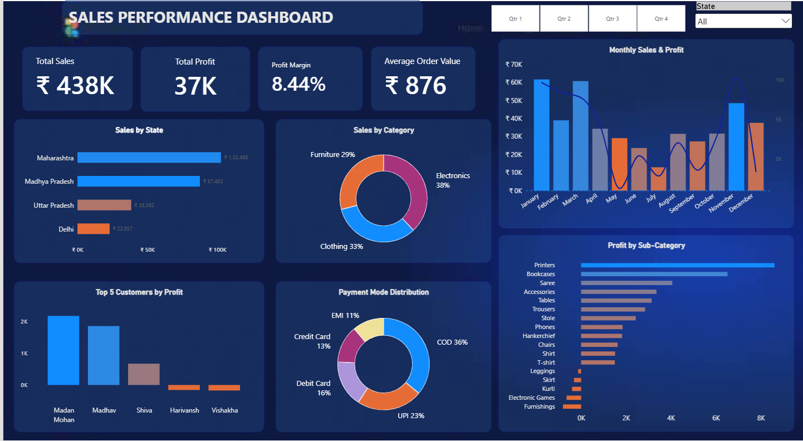

# Sales Performance & Profitability Analysis
**Tools:** Power BI · DAX · Power Query · Data Modeling · Data Visualization

## Business objective

Analyze sales and profitability performance across regions, product categories, sub-categories, customers, payment modes, and time to identify key revenue drivers and areas of profit improvement.

## Business Questions

- Which states contribute the most to overall sales?

- Which product categories drive the most revenue and profit?

- How do sales and profit change over time?

- Which customers generate the highest profit?

- Which sub-categories are most and least profitable?

- How is payment-mode usage distributed?

- What are the overall sales, profit margin, and average order value?

## Dashboard Preview

## Key Performance Indicators

| KPI | Value | Definition |
|---|---:|---|
| Total Sales | ₹437,771 | Total revenue generated |
| Total Profit | ₹36,963 | Total profit generated |
| Profit Margin | 8.44% | Total Profit ÷ Total Sales |
| Average Order Value | ₹875.54 | Total Sales ÷ Distinct Orders |
| Total Orders | 500 | Distinct order IDs |

## Key Insights

- **Maharashtra leads regional sales** with ₹102,498 in revenue, followed by Madhya Pradesh at ₹87,463.
- **Electronics generates the highest sales** at ₹166,267, while **Clothing generates the highest profit** at ₹13,325.
- **Profitability varies significantly by month**, with November recording the highest profit at ₹10,253 and May recording the largest loss at ₹3,730.
- **Printers are the strongest profit contributor** at ₹8,606, followed by Bookcases at ₹6,516.
- **Several sub-categories are loss-making**, including Furnishings, Electronic Games, Kurti, Skirt, and Leggings.
- The business generates **₹437,771 in sales and ₹36,963 in profit**, resulting in an overall **8.44% profit margin**.

## Business Recommendations

- **Focus on high-performing regions:** Prioritize Maharashtra and Madhya Pradesh while evaluating opportunities to improve performance in lower-performing states.
- **Improve category-level profitability:** Investigate why Clothing generates slightly more profit than Electronics despite lower sales, and identify opportunities to improve Electronics margins.
- **Review loss-making sub-categories:** Analyze pricing, discounts, costs, and product-level performance for Furnishings, Electronic Games, Kurti, Skirt, and Leggings.
- **Investigate monthly profit volatility:** Review the causes of loss-making months, particularly May, July, September, and December, to identify recurring patterns.
- **Protect high-profit products:** Continue monitoring strong contributors such as Printers and Bookcases and assess opportunities to scale their performance.
- **Use customer profitability for prioritization:** Focus retention and relationship strategies on customers generating higher profit rather than relying only on order volume.

## Tools & Skills

- **Power BI:** Dashboard development and interactive reporting
- **DAX:** KPI and profitability calculations
- **Power Query:** Data cleaning and transformation
- **Data Modeling:** Working with related sales and order tables
- **Data Visualization:** Selecting appropriate visuals and presenting business insights
- **Business Analysis:** Identifying revenue drivers, profitability patterns, and improvement opportunities  
